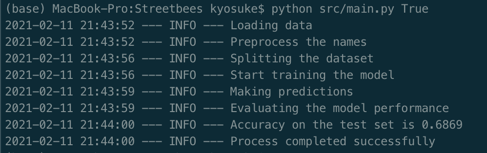

# Prediction of the name class

## Overview
The exercise is to develop a classifier that can determine from name alone whether an entity entered by its users is one of a number of classes. In this exercise there are fourteen non overlapping classes.

## Instructions
For this exercise, I have done brief analyses before I wrote codes. I would be happy if you could have some time to have a look (if you are too busy, it is ok, please read summaries at the top of each notebooks or we can discuss in the interview). "src/notebooks/ExploratoryDataAnalysis.ipynb" is all the EDAs I have done and "src/notebooks/ModellingAnalysis.ipynb" is the modelling analysis (used Naïve bayes, random undersampling + bagging, FastText and Flair model).

To run the code, first please install necessary packages listed in "requirements.txt". Also my Python version is 3.8.5, but I think it should be no problem to run if Python 3.6+.

The command to run the main function is 
```
python src.main.py True
```

This main function takes an argument "train_required". This can take either True or False. If True, it will start a tuning and training, save the model and use that model to predict the preparation time. If False, this function will use the model I have trained. And if anything else, it will exit the program.

This function does following processes:
1. Load the data
2. Preprocess the text
3. Split the data into train and test
4. if train_required == 'False':
    Load the trained model
4. if train_required == 'True':
    Train and save the model
5. Make predictions
6. Evaluate the model
7. Complete the process

** Notice: As I am not putting the model into the repository, please run with "train_required=True" for the first time. **

The log when run with train_required = True will look like below:



### Unit test
I wrote simple unit tests for data preprocessing by using [poetry](https://python-poetry.org/). The tests can be run by
```
pytest tests
```

## Classification model
In this function, I am using Naïve Bayes algorithm. The reason why I chose this model is the trade-off of accuracy and computational cost. This model is quite simple but its accuracy is quite well compared to FastText model and still it's very fast to train and the model size is also light.

## Evaluation of the model
This model achieved accuracy score = 0.6869 on the test set. Comparing to FastText model's accuracy (= 0.7085), it is a bit less accurate but this model runs pretty quick, which is quite important for the business use case.
## Next steps
From the FastText model, it seems using n-gram feature might improve the performance of the model, so as an extension of Naïve Bayes model, it can be applied easily. Similarly, adding part of speech tag in the feature might improve the performance as well. Algorithm-wise, I can try to use neural net model as well especially BiLSTM, but as the input of this model is quite short, I'm not sure how much it will improve the performance and also BiLSTM is computationally expensive. In this context, transformer architecture also might improve the performance but as mentioned above, because of the short input, mussive improvement is questionable. I have tried Flair model in the notebook as well, but for some reasons, the session was killed after 1 epoch (might be running out of the memory). So if I try it in cloud it might solve the issue. But as I mentioned above, those models are quite computationally expensive and the model size is huge. Also I think we can definitely try fine-turned BERT. Its model performance is known to be one of the best and especially this sort of problem setting, this method worked quite well (I have used this method for one of my previous project and worked very well).

As a final remark, I won't say I cracked the imbalanced class distribution problem. Random undersampling + bagging model improved the classification for the minority class ("WrittenWork") but overall classification did not improve. It might be possible to improve this aspect by using more complex models like I mentioned above as next steps.